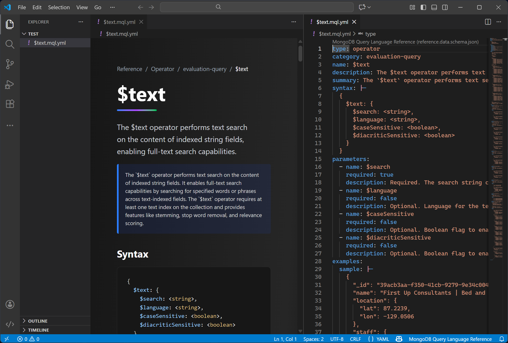

# DocumentDB - MongoDB Query Language (MQL) Reference Extension for Visual Studio Code

This Visual Studio Code extension provides a powerful dual-editing experience for MongoDB Query Language (MQL) reference documentation stored in YAML format. Designed specifically for maintaining and editing structured reference content, it offers both a rich visual interface and traditional YAML text editing with seamless synchronization between the two views. The extension helps technical writers, database administrators, and developers maintain comprehensive MQL documentation with an intuitive point-and-click interface while preserving the flexibility and precision of direct YAML editing.

Whether you're documenting MongoDB operators, aggregation pipeline stages, query methods, or other MQL reference material, this extension streamlines the process by organizing content into categorized sections with links to detailed documentation. The visual editor displays your reference content in a beautifully formatted, easy-to-navigate interface that mirrors how end-users will consume the documentation, while the underlying YAML remains clean, version-control-friendly, and fully editable.



## Features

- **Visual Interface**: Edit MQL reference documentation using an intuitive browser-based interface with sections for syntax, parameters, examples, and related references

- **Two-Way Synchronization**: Changes in the visual editor or text editor are instantly reflected in both views

- **Real-Time Validation**: Built-in JSON schema validation ensures your documentation follows the correct structure

- **Modern UI**: Dark theme interface with syntax highlighting for code examples

## Getting Started

1. Open any `.mql.yaml` or `.mql.yml` file in VS Code

1. Right-click the editor tab and select **"Reopen Editor With..."** > **"Visual Editor"**

Alternatively, right-click a YAML file in Explorer and choose **"Open With..."** > **"Visual Editor"**.

## YAML Structure

The extension works with MongoDB Query Language reference documentation following this structure:

```yaml
type: operator  # or 'command'
category: comparison-query  # varies by type
name: $regex
summary: Provides regular expression capabilities for pattern matching strings in queries
description: Detailed explanation of the operator...
syntax: "{ <field>: { $regex: /pattern/, $options: '<options>' } }"
parameters:
  - name: pattern
    type: pattern
    required: true
    description: The regular expression pattern to match
examples:
  sample: "Collection with product documents"
  items:
    - title: Basic Pattern Match
      description: Find products matching a pattern
      query: "db.products.find({ name: { $regex: /^A/ } })"
      output:
        value: "[{...}]"
related:
  - reference: operators/query/text
```

For more information, see [YAML schema](https://raw.githubusercontent.com/seesharprun-documentdb-prototype/seesharprun-documentdb-prototype.github.io/refs/heads/main/schema/reference.data.schema.json).

## Two-Way Editing

Open the same file in split view to edit visually and as text simultaneously:

1. Open your file with the visual editor

1. Press `Ctrl+\` (Windows/Linux) or `Cmd+\` (macOS) to split the editor

1. The text editor pane will open automatically

1. Edit in either view—changes sync in real-time

## Development

Build and test the extension:

```bash
npm install
npm run compile-web
# Press F5 to debug in a new VS Code window
```

## Technical Stack

- Built with VS Code's Custom Editor API (`CustomTextEditorProvider`)

- React + TailwindCSS v4 for the UI

- `js-yaml` for YAML parsing

- JSON schema validation with `ajv`

- Webpack bundling
